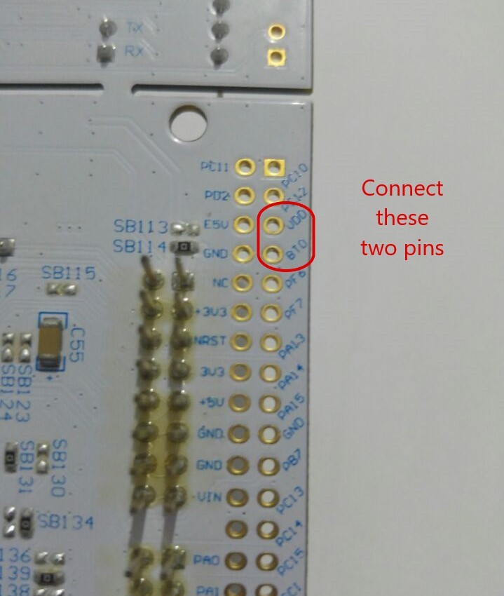

# Micropython-on-Nucleo-F429ZI
This is a guide showing how to port Micropython on the Nucleo-F429ZI and run your micropython code.

## Software Requirements
  1. ARM compiler toolchain
  2. Git
  3. dfu-util (Device firmware update (DFU) tool that is used to program MicroPython over USB onto a microcontroller.)
  
## Linux OS
 
 
 Install the arm compiler toolchain using this command:
 
      $ sudo apt-get install gcc-arm-none-eabi
     
 Install Git using this command:
 
      $ sudo apt-get install git
      
 Install the dfu-util using this command:
 
      $ sudo apt-get install dfu-util
 
 You may need to Install Python using this command:
 
      $ sudo apt-get install python
      
  
 You may need to Install make using this command:
 
      $ sudo apt-get install make
  
  
 You may need to Install GCC using this command:
 
      $ sudo apt-get install gcc
      
 Now that we downloaded all the required software we proceed to the next step.
 
 Download a copy of the micropython repository to your computer using the following command:
 
      $ git clone https://github.com/ziadelmolla/Micropython-for-NUCLEO-F429ZI.git
      
 Go to Micropython-for-NUCLEO-F429ZI using the following command:
 
      $ cd Micropython-for-NUCLEO-F429ZI
      
 The stm32 directory contains the makefile for the NUCLEO_F429ZI board.You can build the firmware for this board using the following commands:
 
     $ make -C mpy-cross
     $ make -C ports/stm32 MICROPY_HW_ENABLE_ETH_RMII=1 BOARD=NUCLEO_F429ZI 
      
 When the build finishes with no errors then we have the firmware ready to be uploaded to the board.
 
 We need to enable the STM32F built-in usb bootloader by connecting two pins on the board with a jumper. The pins are "BT0" and "VDD".
 
 
 

Now connect the board to the computer using the User USB port not the St-link port. But scince the user USB doesn't power up the board you will need to power the board throug the St-link port.

To make sure everything is going well list usb connected devices using this command"

      $ lsusb

You should find a device called "STMicroelectronics STM Device in DFU Mode"

Go to Micropython-for-NUCLEO-F429ZI/ports/stm32 using the following command:
 
      $ cd ports/stm32

Now that the board is connected, you can upload the firmware using this command:

      $ sudo dfu-util -a 0 -d 0483:df11 -D build-NUCLEO_F429ZI/firmware.dfu
      
If this finishes with no errors then MicroPython is now running on the target microcontroller.

Make sure to disconnect "BT0" and "VDD" when you finish.

________________________________________________________________________________________________________________________________________

##Run your first code

Now when you connect the port also through the User USB Port, a window should pop up containing some file.
One of these files is called "main.py" and this where you should write your code.
Write your code, save, then hit the reset button on the board. Your code should be running.

Here is an example you can run wich blinks the board build-in leds.

        import pyb
        import time
        for i in range(0,10):
	           pyb.LED(1).on()
	           pyb.LED(2).off()
	           pyb.LED(3).off()
	           pyb.delay(500)
	           pyb.LED(1).off()
	           pyb.LED(2).on()
	           pyb.LED(3).off()
	           pyb.delay(500)
	           pyb.LED(1).off()
	           pyb.LED(2).off()
	           pyb.LED(3).on()
	           pyb.delay(500)
	
         pyb.LED(1).on()
         pyb.LED(2).on()	
         pyb.LED(3).on()
